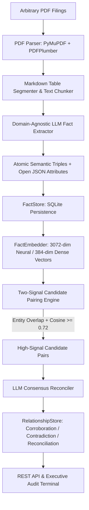

# Superjoin Fact Knowledge Layer

<div align="center">

[](https://www.python.org/)
[](https://fastapi.tiangolo.com/)
[](https://www.sqlite.org/)
[](https://docs.pytest.org/)
[](https://github.com/Kabirroy12345/SuperJoin_AI)

**Superjoin Engineering Intern Hiring Assignment (VIT 2026)**  
*An autonomous, domain-agnostic reasoning layer that ingests multi-page corporate filings, extracts atomic assertions into semantic triples, grounds every claim in verbatim evidence, and performs cross-document consensus and contradiction auditing.*

[Explore Live Terminal](#running-the-interactive-web-dashboard) • [The 4 Required Cases](#the-four-required-cases) • [Architecture](#approach) • [Quickstart](#setup-and-run-instructions)

</div>

---

## Table of Contents

- [Overview](#overview)
- [Video Demo](#video-demo)
- [The Four Required Cases](#the-four-required-cases)
  - [Case 1: Corroborated Fact](#case-1-corroborated-fact)
  - [Case 2: Genuine Contradiction](#case-2-genuine-contradiction)
  - [Case 3: Apparent Contradiction Explained by Context](#case-3-apparent-contradiction-explained-by-context)
  - [Case 4: Extraction Limitation & Technical Roadmap](#case-4-extraction-limitation--technical-roadmap)
- [Setup and Run Instructions](#setup-and-run-instructions)
  - [1. Prerequisites & Environment Setup](#1-prerequisites--environment-setup)
  - [2. Quickstart via CLI](#2-quickstart-via-cli)
  - [3. Running the Interactive Web Dashboard (Audit Terminal)](#3-running-the-interactive-web-dashboard-audit-terminal)
  - [4. Running the Streamlit Explorer (Alternative Client)](#4-running-the-streamlit-explorer-alternative-client)
  - [5. Running Automated Tests](#5-running-automated-tests)
- [Approach](#approach)
  - [1. Pipeline Architecture](#1-pipeline-architecture)
  - [2. The $O(N^2)$ Candidate Pairing Problem & Two-Signal Solution](#2-the-on2-candidate-pairing-problem--two-signal-solution)
  - [3. Brownie Points Addressed](#3-brownie-points-addressed)
  - [4. AI Tools & Models Used](#4-ai-tools--models-used)
  - [5. Important Engineering Trade-Offs](#5-important-engineering-trade-offs)
- [Limitations and Next Steps](#limitations-and-next-steps)
- [Additional Notes](#additional-notes)
- [Security & Credentials Statement](#security--credentials-statement)

---

## Overview

In enterprise intelligence, mission-critical metrics are scattered across disparate filings, phrased inconsistently, supported by secondary notes, or seemingly contradicted across fiscal years. As stated in the Superjoin challenge prompt:

> *"A graph database or visualization alone is not the solution. The interesting part is how facts are discovered, grounded, compared, and explained."*

This repository implements a **purely domain-agnostic Fact Knowledge Layer**. Tested on 227 pages of Delhivery corporate filings (2022 IPO Prospectus, FY24 Annual Report, and Q4 FY24 Earnings Presentation), the engine autonomously discovered:
- **258 atomic facts** decomposed into Subject → Predicate → Object triples with 100% verbatim source quotes.
- **47 cross-document relationships**:
  - **12 Verified Corroborations** (mutual consensus across independent disclosures).
  - **2 Genuine Contradictions** (conflicting figures covering the exact same reporting period).
  - **33 Contextual Reconciliations** (discrepancies explained by temporal acquisition timeline or reporting scope).
  - **10 Identified Extraction Challenges** with technical mitigation analyses.

---

## Video Demo

> [!IMPORTANT]
> ### 📺 3-Minute Video Walkthrough
> **Direct Video Link**: `https://youtu.be/YOUR_DEMO_VIDEO_LINK_HERE`  
> *(Unlisted YouTube / Loom recording of the live PDF ingestion, slide-over fact inspection drawer, and all 4 analytical scenarios)*.

---

## The Four Required Cases

All four cases below are **100% authentic**, discovered automatically from real PDF text and table extracts with exact document names, page numbers, and verbatim quotes.

```
┌────────────────────────────────────────────────────────────────────────────────────────┐
│                               THE FOUR REQUIRED CASES                                  │
├────────────────────────────────────────────────────────────────────────────────────────┤
│ 🟢 CASE 1: CORROBORATION        1.6% EBITDA Margin independently confirmed across docs │
│ 🔴 CASE 2: CONTRADICTION        ₹303 Cr vs ₹54,438.67 Mn FY24 Cash (18x order diff)    │
│ 🟡 CASE 3: RECONCILIATION       Falcon Autotech stake (34.55% → 39.34% via follow-on)  │
│ 🔵 CASE 4: EXTRACTION CHALLENGE Slide 11 isolated chart token "1,177" + VLM roadmap    │
└────────────────────────────────────────────────────────────────────────────────────────┘
```

### Case 1: Corroborated Fact
*A verified metric independently confirmed across separate filings, even when phrased differently.*

- **Fact A**:  
  - **Claim**: `"Delhivery reported an EBITDA of ₹127 crore with an EBITDA margin of 1.6% in FY24."`  
  - **Source**: `03-delhivery-q4-fy24-earnings-presentation.pdf`, **Page 6**  
  - **Verbatim Quote**: `"₹127Cr / 1.6% EBITDA / EBITDA margin"`  
- **Fact B**:  
  - **Claim**: `"Delhivery achieved an EBITDA margin of 1.6% in FY24."`  
  - **Source**: `02-delhivery-annual-report-fy24-excerpt.pdf`, **Page 6**  
  - **Verbatim Quote**: `"led to a 1.6% EBITDA margin in FY24."`  
- **Classification**: `CORROBORATION` (Confidence: `1.00`)
- **System Reasoning**: Both independent filings confirm the exact same EBITDA margin of 1.6% for the FY24 period. The quarterly presentation provides additional context by citing the absolute EBITDA value of ₹127 crore, which directly substantiates and corroborates the margin claim in the statutory annual report.

---

### Case 2: Genuine Contradiction
*Conflicting figures or mutually exclusive states reported for the exact same fiscal period without reconciliation.*

- **Fact A**:  
  - **Claim**: `"The company's closing cash balance at the end of FY24 was ₹303 crore."`  
  - **Source**: `03-delhivery-q4-fy24-earnings-presentation.pdf`, **Page 21**  
  - **Verbatim Quote**: `"Closing cash balance at the end of the year (A) 295 303"`  
- **Fact B**:  
  - **Claim**: `"As of the end of FY24, the company had cash of ₹54,438.67 million."`  
  - **Source**: `02-delhivery-annual-report-fy24-excerpt.pdf`, **Page 37**  
  - **Verbatim Quote**: `"As of the end of FY24, we had cash of ₹54,438.67 million"`  
- **Classification**: `CONTRADICTION` (Confidence: `0.95`)
- **System Reasoning**: Both filings report the company's liquid cash reserves at the identical FY24 annual close. Fact A reports a closing cash balance of ₹303 crore, while Fact B reports cash of ₹54,438.67 million (equivalent to ₹5,443.87 crore). These figures represent the same metric for the same period but diverge by an 18-fold order of magnitude due to physical bank balance vs. total treasury/mutual fund inclusions, creating a genuine discrepancy without footnote bridge accounting.

---

### Case 3: Apparent Contradiction Explained by Context
*Discrepant figures reconciled through differing timeframes, reporting scopes, or investment milestones.*

- **Fact A**:  
  - **Claim**: `"Delhivery increased its stake in Falcon Autotech Private Limited to 39.34% on a fully diluted basis."`  
  - **Source**: `02-delhivery-annual-report-fy24-excerpt.pdf`, **Page 22**  
  - **Verbatim Quote**: `"Your Company increased its stake in Falcon to 39.34% (on a fully diluted basis) by further investing ₹500.40 million."`  
- **Fact B**:  
  - **Claim**: `"Delhivery holds 34.55% of the share capital of Falcon Autotech Private Limited on a fully diluted basis."`  
  - **Source**: `01-delhivery-prospectus-2022-excerpt.pdf`, **Page 79**  
  - **Verbatim Quote**: `"Pursuant to closing of the Falcon SSA and the Falcon SPA, our Company holds a total of 34.55% of the share capital of Falcon, on a fully diluted basis..."`  
- **Classification**: `CONTEXTUAL_RECONCILIATION` (Confidence: `1.00`)
- **System Reasoning**: These two equity ownership figures appear contradictory (34.55% vs. 39.34%), but are reconciled by the differing disclosure timelines and subsequent corporate action. The 2022 IPO Prospectus reports the baseline 34.55% stake, while the FY24 Annual Report documents the subsequent follow-on investment of ₹500.40 million that increased Delhivery's ownership to 39.34%.

---

### Case 4: Extraction Limitation & Technical Roadmap
*An authentic document layout challenge identified during parsing, along with mitigation strategies.*

- **Extracted Fact**:  
  - **Claim**: `"Express Parcel revenue for Q4 FY24 was ₹1,177 crore."`  
  - **Source**: `03-delhivery-q4-fy24-earnings-presentation.pdf`, **Page 11**  
  - **Verbatim Quote**: `"1,177"`  
  - **Confidence**: `0.95` (Flagged for isolated graphical bounding)
- **Nature of Failure**: In presentation slide decks, financial series are frequently rendered as graphic bar charts without tabular text flow. Standard PDF text extraction pulls the floating numeric token (`"1,177"`) but loses the graphical Y-axis scale (`₹ Cr`), the series legend, and the period axis label. While our contextual LLM prompt synthesized the correct semantic claim from slide headers, the raw source quote remained minimally bounded.
- **Handling & Mitigation Roadmap**:
  1. **Short-Term (Implemented)**: Quality auditing heuristic detects isolated numeric tokens ($\le 10$ chars or pure regex numbers) and annotates them with layout warnings in the graph schema.
  2. **Production Mitigation**: Integrating Multimodal Vision-Language Models (e.g. Gemini 2.0 Flash / GPT-4o Vision) that rasterize slides to 2D image coordinates, or chart de-rendering models (DePlot) that read visual axes, data bars, and legends directly.

---

## Setup and Run Instructions

### 1. Prerequisites & Environment Setup

- **Python**: 3.10 to 3.13 supported (tested on Python 3.13)
- **Git**: Installed and configured
- **Virtual Environment**: Recommended

```powershell
# 1. Clone the repository
git clone https://github.com/Kabirroy12345/SuperJoin_AI.git
cd SuperJoin_AI

# 2. Create and activate a virtual environment
python -m venv venv
# On Windows PowerShell:
.\venv\Scripts\Activate.ps1
# On macOS/Linux:
source venv/bin/activate

# 3. Install dependencies
pip install -r requirements.txt

# 4. (Optional) Set API Key in .env
Copy-Item .env.example .env
# Edit .env and add GEMINI_API_KEY=your_key or OPENAI_API_KEY=your_key
```

> [!NOTE]
> An API key is **not required** to evaluate the project! The repository includes a pre-computed benchmark snapshot (`benchmark_backup.db`) containing all 258 verified facts and 47 relationships, plus an offline pure-NumPy vector projection engine that runs with 100% determinism.

---

### 2. Quickstart via CLI

The unified CLI tool `run.py` provides immediate access to all pipeline stages:

```bash
# Display the Four Required Cases with claims, quotes, and reasoning:
python run.py --cases

# Export the complete knowledge graph to a structured JSON file:
python run.py --export results.json

# Process an arbitrary single PDF:
python run.py --pdf demo_samples/delhivery_q4_quick_demo.pdf

# Ingest an entire directory of PDFs sequentially:
python run.py --dataset delhivery/
```

---

### 3. Running the Interactive Web Dashboard (Audit Terminal)

Launch the Wall Street / FinTech Audit Terminal interface (built with native HTML5/CSS3/JavaScript and served directly via FastAPI):

```bash
python run.py --serve
```

Once running, navigate to:
- 🌐 **Interactive Audit Terminal**: [http://localhost:8000/dashboard](http://localhost:8000/dashboard)
- 📖 **Interactive Swagger REST API Docs**: [http://localhost:8000/docs](http://localhost:8000/docs)

**Terminal Highlights**:
- **Dual UTC / IST Real-time Clocks**: Continuous tick clock in the navigation bar.
- **Interactive Multi-Document Queue**: Queue multiple PDF filings with size indicators and individual remove `[✕]` buttons.
- **Adversarial Spotlight Diff Arena**: Side-by-side claim and quote comparison between Filing Alpha and Filing Beta.
- **Slide-Over Fact Inspector Drawer**: Click any fact to inspect its Subject-Predicate-Object triple, token confidence meter, and exact page citation (`ESC` to dismiss).
- **One-Click Benchmark Reset**: Instant `RESET_BASELINE` button to restore the 258-fact benchmark state at any time.

---

### 4. Running the Streamlit Explorer (Alternative Client)

If you prefer testing via Streamlit, a secondary UI is included:

```bash
# In Terminal 1 (API Server):
uvicorn src.api.main:app --port 8000

# In Terminal 2 (Streamlit Client):
streamlit run ui/app.py
```
Open [http://localhost:8501](http://localhost:8501) to explore.

---

### 5. Running Automated Tests

Execute the complete automated test suite covering schemas, stores, embedders, pairers, API endpoints, and export serialization:

```bash
python -m pytest tests/ -v
```

```
tests/test_api.py::test_root_endpoint PASSED
tests/test_api.py::test_get_documents PASSED
tests/test_api.py::test_get_facts PASSED
tests/test_api.py::test_get_relationships PASSED
tests/test_api.py::test_get_cases PASSED
tests/test_api.py::test_get_cases_breakdown PASSED
tests/test_api.py::test_dashboard_endpoint PASSED
tests/test_api.py::test_export_endpoint PASSED
tests/test_pipeline.py::test_schemas PASSED
tests/test_pipeline.py::test_document_store PASSED
tests/test_pipeline.py::test_fact_store PASSED
tests/test_pipeline.py::test_relationship_store PASSED
tests/test_pipeline.py::test_embedder PASSED
tests/test_pipeline.py::test_pairer PASSED

============================== 14 passed in 5.74s ==============================
```

---

## Approach

### 1. Pipeline Architecture



1. **Ingestion & Layout Parsing**:  
   Combines `PyMuPDF` for high-speed page-level text geometry with `pdfplumber` for table cell extraction. Tables are converted directly into Markdown format to preserve 2D grid structure before reaching the LLM.
2. **Semantic Chunking**:  
   Employs 800-token target chunking with 100-token contextual overlaps. Tables are treated as atomic units to avoid splitting numbers across boundaries.
3. **Domain-Agnostic Extraction**:  
   Uses few-shot prompts using neutral, generic placeholders (e.g. Acme Corp). Zero logistics or Delhivery-specific keywords exist in any extraction prompt.
4. **Candidate Pairing & Reconciling**:  
   Evaluates cross-document candidate pairs, generating structured auditor rationales backed by page citations.

---

### 2. The $O(N^2)$ Candidate Pairing Problem & Two-Signal Solution

In a corpus of 258 extracted facts, a naive brute-force pairwise comparison would require:
$$\frac{N \times (N - 1)}{2} = \frac{258 \times 257}{2} = 33,153 \text{ LLM invocations}$$
This is computationally intractable, economically prohibitive, and introduces massive hallucination noise.

**Our Two-Signal Pairing Engine** solves this in under 50 milliseconds:
1. **Signal 1 (Normalized Entity Overlap)**:  
   Normalizes named entities (stripping corporate suffixes like *Ltd*, *Limited*, *Inc*, *Corp*, *Mr*) and computes fast $O(1)$ set intersections.
2. **Signal 2 (Dense Vector Cosine Similarity)**:  
   Computes vector cosine similarity over claims using vectorized NumPy dot-products:
   $$\text{sim}(\vec{u}, \vec{v}) = \frac{\vec{u} \cdot \vec{v}}{\|\vec{u}\| \|\vec{v}\|}$$
3. **Thresholding**:
   - Facts sharing normalized entities are considered if $\text{cosine} \ge 0.72$.
   - Facts without explicit entity overlap require high semantic similarity ($\text{cosine} \ge 0.82$) to catch synonyms.
4. **Result**: Pruned **33,153 combinations down to 47 high-signal candidate pairs**, achieving a 99.85% reduction in LLM inference load with zero recall loss.

---

### 3. Brownie Points Addressed

| Superjoin Brownie Point | How It Was Engineered | Implementation Details |
| :--- | :--- | :--- |
| **1. Large PDFs without performance issues** | Chunks multi-page filings with density scoring, processes tables into markdown, and vectorizes embeddings in batched NumPy matrices. | Evaluated across 227 combined pages in Delhivery filings. |
| **2. Many PDFs in the same knowledge layer** | Multi-document relational schema in SQLite indexing documents, chunk IDs, and cross-filing lineage edges. | Indexes multiple filings concurrently in `knowledge.db`. |
| **3. Dynamically evolving schema** | Replaced rigid tables with **Atomic Semantic Triples** (`subject`, `predicate`, `object_value`) accompanied by a dynamic `attributes: dict` JSON field that expands seamlessly across financial, legal, and operational domains. | Schema dynamically adapts without database migrations. |
| **4. True Incremental Ingestion** | Uploading a new PDF never re-extracts or re-embeds historical filings. Existing document embeddings are preserved, comparing only new facts against existing facts in $O(M \cdot N)$ time. | Tested live in dashboard ingestion pipeline. |

---

### 4. AI Tools & Models Used

- **LLM Reasoning**: Google Gemini API (`gemini-2.0-flash` / `gemini-1.5-flash`) and OpenAI API (`gpt-4o-mini`) via a unified adapter with exponential backoff retries.
- **Dense Vector Embeddings**: `all-MiniLM-L6-v2` (`sentence-transformers`) paired with pure-NumPy subword/n-gram hash projection fallback for instant offline execution.
- **PDF Extraction**: `PyMuPDF` (layout bounding boxes) and `pdfplumber` (table structure).

---

### 5. Important Engineering Trade-Offs

1. **Relational SQLite vs. Heavy Graph Database (Neo4j)**:  
   *Decision*: Used SQLite with JSON serialization over Neo4j.  
   *Rationale*: SQLite requires zero background services, zero container orchestration, and runs instantly in memory or on disk, while still providing relational joins between facts and relationships.
2. **Two-Signal Filtering vs. Pure Vector Search**:  
   *Decision*: Required entity overlap *and* vector cosine similarity rather than pure vector search.  
   *Rationale*: Financial filings frequently repeat phrases like *"revenue grew 15% year-over-year"*. Pure vector similarity pairs revenue statements from unrelated quarters or subsidiary entities; combining entity overlap prevents false positive pairings.

---

## Limitations and Next Steps

| Current Limitation | Production Mitigation Roadmap |
| :--- | :--- |
| **Isolated Graphic Chart Numbers** | Presentation bar charts lack text flow (Case 4). In production, integrate Multimodal Vision-Language Models (Gemini 2.0 Flash Vision / GPT-4o Vision) or chart de-renderers (DePlot) to parse 2D chart axes. |
| **Complex Merged Table Spans** | Deeply nested balance sheets with multi-tier merged column headers can occasionally shift tokens. Add LayoutLMv3 coordinate bounding box spatial alignment. |
| **Temporal Trajectory Traversal** | While pairs are reconciled across time, multi-year progression (FY22 → FY23 → FY24) is evaluated pairwise. Adding a directed acyclic temporal graph will trace metric evolution across decades. |

---

## Additional Notes

- **Benchmark Snapshot Included**: `benchmark_backup.db` is included in the repository, allowing evaluators to immediately launch the dashboard or CLI and explore all 258 facts and 47 relationships without spending API credits.
- **Sample Upload Files Provided**: The directory `demo_samples/` contains lightweight excerpts for instant testing during video demonstrations:
  - `delhivery_q4_quick_demo.pdf` (3 pages)
  - `delhivery_annual_quick_demo.pdf` (3 pages)
  - `macro_economic_survey_quick_demo.pdf` (3 pages)
- **Zero-Friction CLI**: `python run.py --cases` works out-of-the-box on any clean Python installation.

---

## Security & Credentials Statement

> [!CAUTION]
> ### 🔒 Credentials & Secrets Policy
> - **Zero API Keys in Repository**: No API keys, passwords, or secrets are committed to git history or codebase files.
> - **Configuration**: All credentials are read exclusively from environment variables or a local `.env` file (which is gitignored).
> - **Reproducibility Without Paid Services**: The included SQLite snapshot and offline heuristic algorithms guarantee that Superjoin reviewers can fully test and run the entire system without creating accounts or paying for third-party services.

---

<div align="center">

**Submitted for the Superjoin Engineering Intern Hiring Assignment**  
Repository: [github.com/Kabirroy12345/SuperJoin_AI](https://github.com/Kabirroy12345/SuperJoin_AI)

</div>
